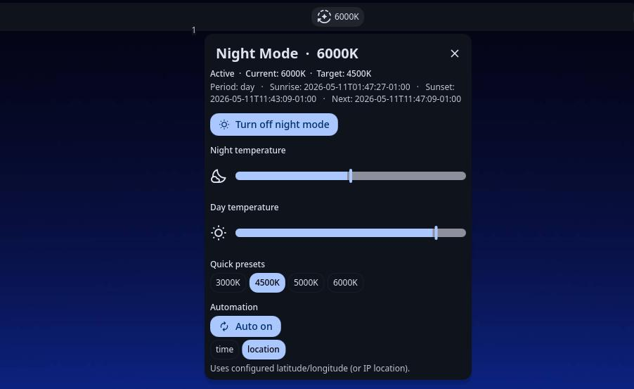
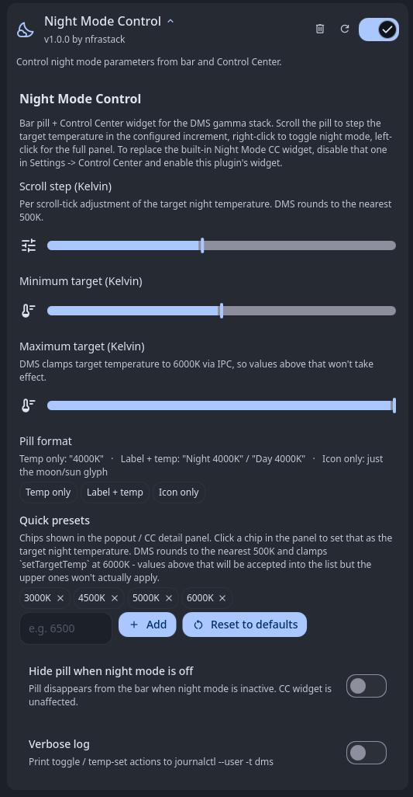

# nfrastack/dms-nightModeControl

## About

Night Mode Control is a DankMaterialShell (DMS) plugin that surfaces the gamma / night-mode stack on a configurable bar pill and Control Center tile. The pill shows the live gamma temperature in Kelvin, scrolls to step the target, right-clicks to toggle night mode, and clicks for a popout with target / day sliders, automation toggle, time-vs-location mode picker, schedule readout, and quick presets. This is intended as a drop in replacement for the stock `nightMode` CC widget.

## Features

- Bar pill with dynamic icon
- Three pill format options: temp only, label + temp (`Night 3000K`), icon only
- Scroll wheel on the pill bumps the target temperature in configurable Kelvin steps
- Right-click the pill toggles night mode
- Left-click the pill opens the popout
- Detail panel surface:
  - Status line: active state, current K, target K, period (day/night), sunrise / sunset / next transition
  - On / off button
  - Target night temperature slider
  - Day temperature slider
  - Quick-preset chips (`3000K` - `6000K` in 500K steps)
  - Automation on/off + segmented `time` / `location` mode picker

## Maintainer

- [Nfrastack](mailto:code@nfrastack.com)

## Table of Contents

- [About](#about)
- [Features](#features)
- [Maintainer](#maintainer)
- [Requirements](#requirements)
- [Installation](#installation)
- [Configuration](#configuration)
- [Usage](#usage)
- [Permissions](#permissions)
- [Support & Maintenance](#support--maintenance)
- [License](#license)

## Requirements

- DankMaterialShell 1.5-beta or later (DMS API version ≥ 6 for the `wayland.gamma` capability)
- A Wayland compositor with `wlr-gamma-control-unstable-v1` (Hyprland, niri, Sway, river)
- DMS daemon reporting `gamma` in its capabilities (`DisplayService.gammaControlAvailable === true`)

## Screenshots

- Overview


- Settings



## Installation

```bash
mkdir -p ~/.config/DankMaterialShell/plugins/
git clone https://github.com/nfrastack/dms-nightModeControl ~/.config/DankMaterialShell/plugins/nightModeControl
```

- Visit Settings -> Plugins, refresh your plugin directory, enable `Night Mode Control`
- Add the pill to your bar layout in Settings -> Top Bar.
- To replace the stock CC tile, disable the built-in `Night Mode` widget in Settings -> Control Center and enable this plugin's widget in the same place.

## Configuration

| Key                | Type          | Description                                                                                                              | Default       |
| ------------------ | ------------- | ------------------------------------------------------------------------------------------------------------------------ | ------------- |
| `stepK`            | int           | Per scroll-tick adjustment of the target night temperature, in Kelvin. DMS rounds target to 500K so 500 is natural.      | `500`         |
| `minK`             | int           | Lower bound for scroll / slider on the target night temperature, in Kelvin.                                              | `3000`        |
| `maxK`             | int           | Upper bound for scroll / slider on the target night temperature. DMS IPC clamps to 6000K — values above won't apply.     | `6000`        |
| `pillFormat`       | string        | Bar pill display mode. One of: `tempOnly` (e.g. `4000K`), `labelTemp` (`Night 4000K` / `Day 4000K`), `iconOnly`.         | `tempOnly`    |
| `presetTempsK`     | array of ints | Quick-preset chips shown in the detail panel. Each click persists that target temperature. Editable in the settings page.| `[3000..6000]`|
| `hideWhenInactive` | bool          | Hide the bar pill when night mode is off. CC widget is unaffected.                                                       | `false`       |
| `debugLog`         | bool          | Print toggle / temp-set actions to `journalctl --user -t dms`.                                                           | `false`       |

The settings page exposes all keys above. Use `Reset to defaults` under the preset chip editor to restore the canonical 3000–6000K list.

## Usage

- Bar pill - shows current Kelvin while night mode is on, target Kelvin while it's off. Scroll up raises the target by `stepK` (cooler), scroll down lowers it (warmer). Right-click toggles night mode. Left-click opens the detail popout.
- Control Center -> Night Mode - clicking the tile toggles night mode without expanding (matches built-in behaviour). The expander chevron opens the same detail panel as the popout.
- Sliders / quick presets - write through `dms ipc call night setTargetTemp` / `setDayTemp`. DMS rounds to the nearest 500K and re-applies immediately if night mode is on.
- Automation - toggling on starts time-based or location-based scheduling depending on `nightModeAutoMode`. Time-of-day and lat/long config still live in DMS Settings -> Display -> Gamma.

## Permissions

The plugin requests:

- `settings_read` — read step / range / pill format / preset list / hide-when-inactive / debugLog
- `settings_write` — save edits from the settings page
- `process` — invoke `dms ipc call night …` for target / day temperature changes

All gamma state goes through the DMS daemon's existing `wayland.gamma.*` request handlers.

## Support & Maintenance

- For community help, tips, and community discussions, visit the [Discussions board](../../discussions).
- For personalized support or a support agreement, see [Nfrastack Support](https://nfrastack.com/).
- To report bugs, submit a [Bug Report](issues/new). Usage questions may be closed as not-a-bug.
- Feature requests are welcome, but not guaranteed. For prioritized development, consider a support agreement.
- Updates are best-effort, with priority given to active production use and support agreements.

## License

MIT. See the [LICENSE](LICENSE) file.
